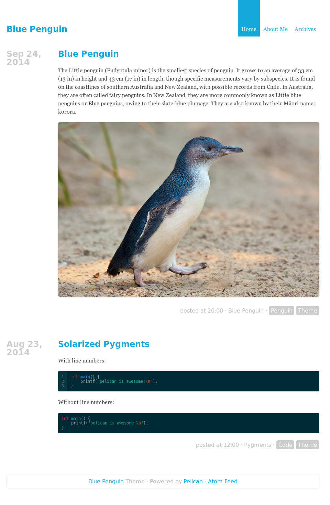

# Blue Penguin for pelican
A simple theme for pelican. Solarized pygments. Feeds support.

## Settings
```python
# all the following settings are *optional*

# HTML metadata
SITEDESCRIPTION = ''

# all defaults to True.
DISPLAY_HEADER = True
DISPLAY_FOOTER = True
DISPLAY_HOME   = True
DISPLAY_MENU   = True

# provided as examples, they make ‘clean’ urls. used by MENU_INTERNAL_PAGES.
TAGS_URL           = 'tags'
TAGS_SAVE_AS       = 'tags/index.html'
AUTHORS_URL        = 'authors'
AUTHORS_SAVE_AS    = 'authors/index.html'
CATEGORIES_URL     = 'categories'
CATEGORIES_SAVE_AS = 'categories/index.html'
ARCHIVES_URL       = 'archives'
ARCHIVES_SAVE_AS   = 'archives/index.html'

# use those if you want pelican standard pages to appear in your menu
MENU_INTERNAL_PAGES = (
    ('Tags', TAGS_URL, TAGS_SAVE_AS),
    ('Authors', AUTHORS_URL, AUTHORS_SAVE_AS),
    ('Categories', CATEGORIES_URL, CATEGORIES_SAVE_AS),
    ('Archives', ARCHIVES_URL, ARCHIVES_SAVE_AS),
)
# additional menu items
MENUITEMS = (
    ('GitHub', 'https://github.com/'),
    ('Linux Kernel', 'https://www.kernel.org/'),
)
```

## How to contribute
Contributions are very welcome. Keep in mind that this theme goal is to be
minimalistic/simple. Contributions will be accepted through Github Pull
Requests. If you don’t have a Github account you can suggest me your
changes by email (which you can find on my github profile).

## Contributors
See [CONTRIBUTORS.md](CONTRIBUTORS.md).

## License
Public domain.
